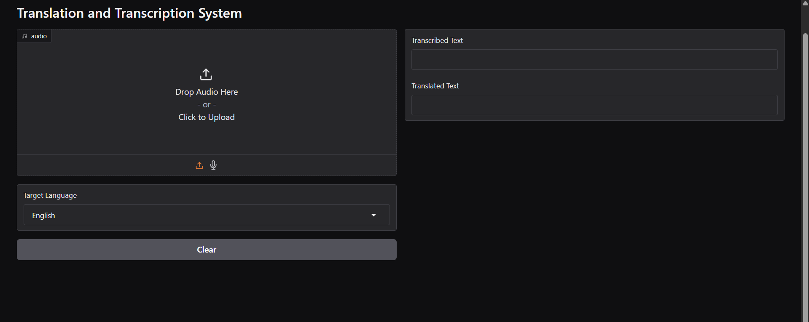
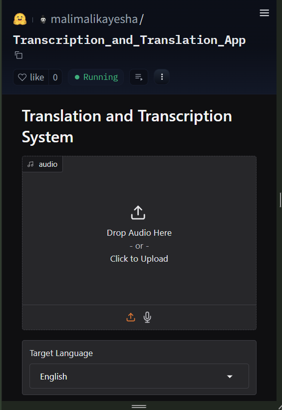
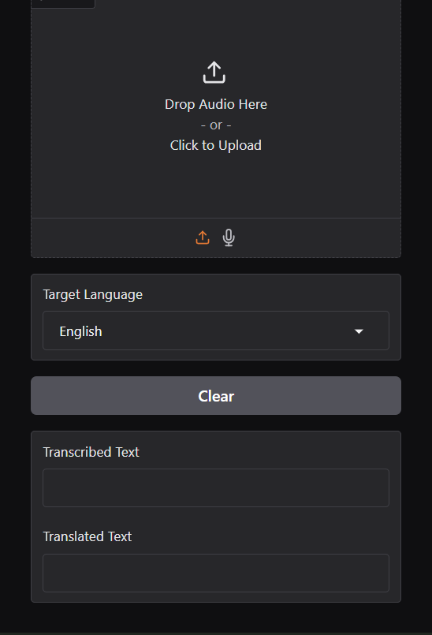

# 🔄 Translation and Transcription System

A powerful web application that converts audio to text and translates it into multiple languages using advanced AI models.

## 📋 Table of Contents

- [Overview](#overview)
- [Application Interface](#application-interface)
- [Features](#features)
- [Technologies](#technologies)
- [Installation](#installation)
- [Usage](#usage)
- [Supported Languages](#supported-languages)
- [How It Works](#how-it-works)
- [Links](#links)

## 🎯 Overview

This application provides an intuitive interface for real-time audio transcription and translation. Simply upload an audio file or record an audio, select your target language, and get both the transcribed text and its translation instantly. The app features a modern dark theme and works seamlessly on both desktop and mobile devices.

## 📱 Application Interface

### Laptop Mode



<p align="center"><em>Application interface in laptop mode showing the full desktop layout</em></p>

### Mobile View

<div align="center">
  
  &nbsp;&nbsp;
  
</div>

<p align="center"><em>Mobile interface showing the responsive design for smaller screens</em></p>

## ✨ Features

- **Audio Transcription**: Convert speech to text using OpenAI's Whisper model
- **Multi-language Translation**: Translate transcribed text into 7 different languages
- **Real-time Processing**: Live transcription and translation
- **Multiple Input Methods**: Upload audio files or record directly through the interface
- **Responsive Design**: Works perfectly on desktop and mobile devices
- **Dark Theme Interface**: Modern, eye-friendly design
- **Format Support**: WAV, MP3, M4A, FLAC audio formats

## 🛠️ Technologies

- **[OpenAI Whisper](https://github.com/openai/whisper)**: State-of-the-art speech recognition model
- **[Gradio](https://gradio.app/)**: Web interface framework for machine learning applications
- **[Deep Translator](https://github.com/nidhaloff/deep-translator)**: Translation library using Google Translate API
- **[PyTorch](https://pytorch.org/)**: Deep learning framework for model execution
- **Python 3.7+**: Core programming language

## 🚀 Installation

### Prerequisites

- Python 3.7 or higher
- Git

### Setup Instructions

1. **Clone the repository**

   ```bash
   git clone https://huggingface.co/spaces/malimalikayesha/Transcription_and_Translation_App
   cd Transcription_and_Translation_App
   ```

2. **Create virtual environment**

   ```bash
   python -m venv venv
   venv\Scripts\activate  # On Windows
   # source venv/bin/activate  # On macOS/Linux
   ```

3. **Install dependencies**

   ```bash
   pip install -r requirements.txt
   ```

4. **Run the application**

   ```bash
   python app.py
   ```

5. **Access the application**
   - Click on the link that appears in the terminal (typically `http://127.0.0.1:7860`)
   - The interface will load in your browser
   - **Note**: Transcription and translation may take a while when running on local CPU

## 🎮 Usage

### Step-by-Step Guide

1. **Upload/Record Audio**

   - Click "Drop Audio Here" or drag and drop your audio file or use the mic icon to record audio
   - Supported formats: WAV, MP3, M4A, FLAC
   - Or use the microphone icon to record directly

2. **Select Target Language**

   - Choose your desired translation language from the dropdown
   - Available options: English, Spanish, French, German, Chinese, Japanese, Urdu

3. **Process & View Results**
   - The system automatically processes your audio
   - View the original transcribed text in the left panel
   - See the translated text in the right panel
   - Use the "Clear" button to reset and start over

## 🌍 Supported Languages

| Language   | Code | Language                | Code  |
| ---------- | ---- | ----------------------- | ----- |
| English 🇺🇸 | en   | German 🇩🇪               | de    |
| Spanish 🇪🇸 | es   | Chinese (Simplified) 🇨🇳 | zh-cn |
| French 🇫🇷  | fr   | Japanese 🇯🇵             | ja    |
| Urdu 🇵🇰    | ur   |                         |       |

## ⚙️ How It Works

### Technical Process

1. **Audio Processing**

   - Audio files are loaded and normalized to 30-second segments
   - Converted to log-Mel spectrogram format for processing

2. **Speech Recognition**

   - OpenAI Whisper "base" model processes the audio
   - Generates high-accuracy text transcription

3. **Language Translation**

   - Google Translator automatically detects the source language
   - Translates the transcribed text to the selected target language

4. **Real-time Display**
   - Both transcribed and translated texts are displayed simultaneously
   - Results appear instantly as processing completes

## 🔗 Links

- **Live Demo**: [Hugging Face Space](https://huggingface.co/spaces/malimalikayesha/Transcription_and_Translation_App)
- **Whisper Documentation**: [OpenAI Whisper](https://github.com/openai/whisper)
- **Gradio Documentation**: [Gradio Docs](https://gradio.app/docs/)

---

**Made with ❤️ by [malimalikayesha](https://www.linkedin.com/in/malikmalikayesha/)**
